# 🥯 Bagel

  
  
  ### Provision Cloud Infrastructure, The Easy Way
  
  *Bagel makes deploying Terraform seamless — no workflow knowledge required.*
  
  
  
  

---

## 🌟 What is Bagel?

Bagel is an **open-source self-service platform** that transforms the way developers deploy cloud infrastructure. Built with the warmth and attention to detail of a European bakery, Bagel makes Terraform deployments as simple and delightful as enjoying fresh-baked bread.

  
  
<em>Beautiful, intuitive dashboard that makes infrastructure management effortless</em>

## ✨ Key Features

<table>
<tr>
<td width="50%">

### 🔄 **Self-Service Deployment**
Deploy infrastructure independently with no DevOps bottlenecks. Simple, intuitive, and powerful.

### 🔗 **GitHub Integration** 
Seamlessly connect your repositories and trigger deployments directly from your existing workflow.

</td>
<td width="50%">

### ⚡ **User-Friendly UI**
Beautiful, artisanal interface that makes complex infrastructure management feel effortless.

### 👥 **Open-Source Community**
Built by developers, for developers. Join our growing community of infrastructure enthusiasts.

</td>
</tr>
</table>

## 🚀 How It Works

```mermaid
graph LR
    A[📁 Push Code] --> B[🔗 Connect Repo] --> C[🚀 Deploy]
```

  

| Step | Action | Description |
|------|--------|-------------|
| **1** | 📁 **Push Terraform Code** | Push your Terraform infrastructure code to your GitHub repository |
| **2** | 🔗 **Connect Repository** | Connect your GitHub repo to Bagel's intuitive platform |  
| **3** | 🚀 **Deploy with One Click** | Deploy your infrastructure seamlessly with our user-friendly interface |

  <em>Three simple steps to get from code to cloud ☁️</em>

## 📊 Community Stats

  
  | 🌟 Stars | 🍴 Forks | 🚀 Deployments | 👥 Developers |
  |----------|----------|-----------------|----------------|
  | **2.3k+** | **400+** | **10k+** | **500+** |
  

## 🍞 Why "Bagel"?

Just like a master baker perfecting their craft, we've carefully designed each feature to make infrastructure deployment a delightful experience. Our philosophy:

> *"Like sharing a recipe that's been in the family for generations, we believe great infrastructure tools should be available to everyone."*
> 
> — The Bagel Team

  
  
<em>Artisanal quality, industrial strength</em>

## 🤝 Join Our Community

  
  
  
  
  

---

  
  **Built with ❤️ by the open source community**
  
  *Freshly baked infrastructure, served daily* 🥯
  

